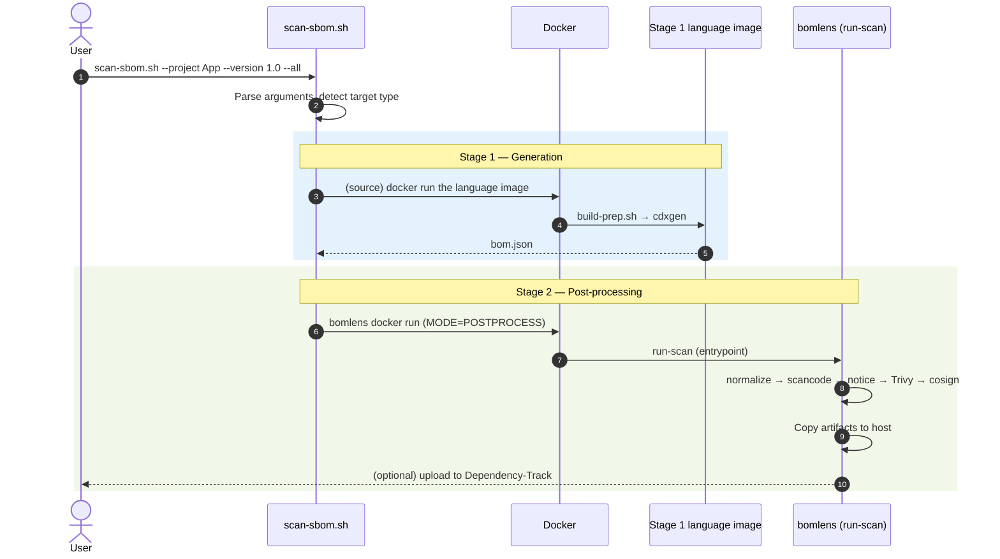
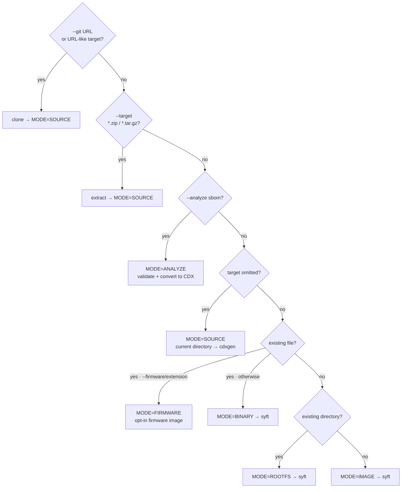
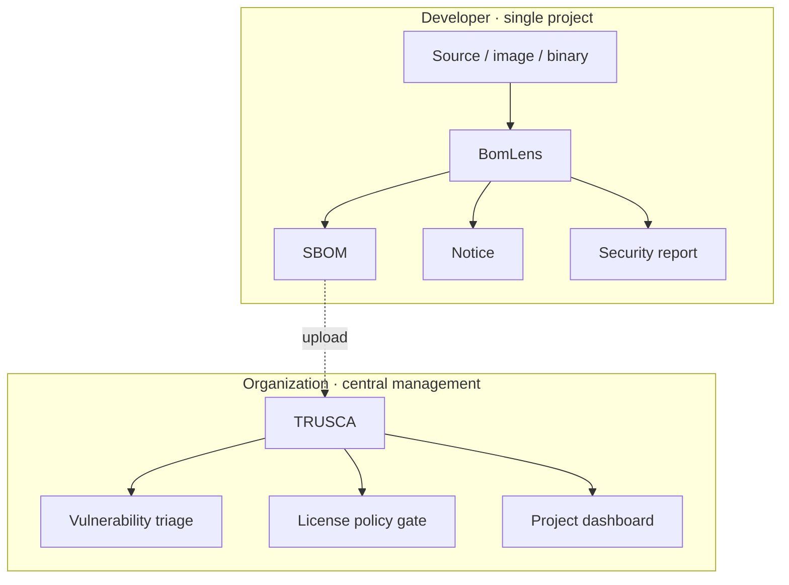

# Architecture

This document describes the overall system structure of BomLens and explains which tool runs at which step of the scan pipeline, and in what order.

For the per-input tool flow — source code (with the ScanCode and SCANOSS options), firmware, a received SBOM, and an AI model — see [Pipeline by input type](pipeline-by-input.md).

> This document reflects the 2-stage architecture as currently implemented. The Stage 1 routing in the source code (detect the language, then run the official cdxgen language image) is implemented and working in `scripts/scan-sbom.sh`.

## At a glance

BomLens is a 2-stage pipeline in which two kinds of Docker images work together.

- **Stage 1 — Generation**: for source code, the official per-language cdxgen images generate the SBOM (CycloneDX 1.6); for container images, binaries, and directories, syft does.
- **Stage 2 — Post-processing**: the lightweight `bomlens` image takes the SBOM and runs normalization, optional deep license detection, notice generation, the security report, signing, and upload in order.

The single entry point for orchestration is `scripts/scan-sbom.sh` (`scan-sbom.bat` on Windows); this is the only script users invoke.

---

## Why two stages

Previously, every language runtime plus every analysis tool lived in a single huge image. The redesigned pipeline splits the responsibilities in two.

| | Stage 1 image | Stage 2 image (`bomlens`) |
|---|---|---|
| **Role** | **Generates** the SBOM from source | SBOM **post-processing** (normalization, notice, security, signing, upload) plus syft scans |
| **Contents** | Official **per-language** cdxgen images (java, python, node, ...) | **No** language toolchain — lightweight `debian:12-slim` |
| **Acquisition** | Pulled **on demand** after detecting the project language | Pulled once and reused |
| **Benefit** | cdxgen maintains up-to-date per-language toolchains | Small image; pinned tool versions ensure reproducibility |

> For the five mainstream languages (java, python, node, dotnet, php), detection with the official cdxgen images is identical, and for go, ruby, and rust the toolchain preparation (`build-prep.sh`) is markedly better. For the measurement data, see [README "Why a Docker image?"](https://github.com/sktelecom/bomlens#why-a-docker-image-vs-plain-cdxgen).

---

## Tool inventory

The tools invoked by the pipeline and their **version pinning** status (supply chain hygiene).

| Tool | Version | Stage | Role | Enabled when |
|------|------|------|------|-----------|
| **cdxgen** | bundled in the language image | Stage 1 | Generates the SBOM from source code (`--spec-version 1.6`) | `MODE=SOURCE` |
| **build-prep.sh** | — | Stage 1 | Dependency preparation right before cdxgen (cargo, go, bundle, mvn, pip) | `MODE=SOURCE` |
| **syft** | `v1.51.0` | Stage 1 | Scans images, binaries, and root filesystems | `MODE=IMAGE/BINARY/ROOTFS` |
| **jq** (`normalize-sbom.sh`) | — | Stage 2 | Normalizes and sorts the SBOM | Always |
| **ScanCode Toolkit** | `32.5.0` | Stage 2 | Precise license detection on first-party source | `--deep-license` (opt-in build) |
| **SCANOSS** | `1.54.2` | Stage 2 | Identify vendored open source in C/C++ source with no package manager | `--identify-vendored` |
| **jq** (`generate-notice.sh`) | — | Stage 2 | Generates the open source notice (NOTICE) | `--notice` / `--all` |
| **Trivy** | `v0.74.0` | Stage 2 | Vulnerability (CVE) security report | `--security` / `--all` |
| **Cosign** | `v2.6.5` | Stage 2 | Detached SBOM signature | `--sign` |
| **curl** | — | Stage 2 | Upload to Dependency-Track | Default (unless `--generate-only`) |

> Versions are pinned as `ARG`s in `docker/Dockerfile`. To keep the image lean, ScanCode is an **opt-in** build arg (`--build-arg SBOM_DEEP_LICENSE=true`). The SCANOSS client is included by default; build with `--build-arg SBOM_SCANOSS=false` to drop it. Firmware unpacking/identification (unblob, cve-bin-tool) ships in the separate opt-in `bomlens-firmware` image, and AI-model SBOM generation (OWASP AIBOM Generator) in `bomlens-aibom`. For the per-input tool flow, see [Pipeline by input type](pipeline-by-input.md).

---

## Full pipeline flow

The **order** in which tools are invoked, in one diagram. Dashed boxes are optional steps enabled by flags.

The sequence from the user's invocation through post-processing:

---

## Stage 1 — SBOM generation

The generation tool depends on the target type.

### Source code (`MODE=SOURCE`) — cdxgen language image

`scan-sbom.sh` detects the project language with `detect_lang()`, picks the matching **official cdxgen language image** with `img_for_lang()`, pulls it, and runs `build-prep.sh` inside that image (`scripts/scan-sbom.sh:138-208`). The lightweight post-processing image has no language toolchain, so generation is handled entirely by the language image.

The per-language cdxgen image mapping is as follows (`scan-sbom.sh:158-177`; the tag is pinned via `CDXGEN_TAG`).

| Detected language | Image |
|-----------|--------|
| rust | `cdxgen-debian-rust` |
| go | `cdxgen-debian-golang124` |
| ruby | `cdxgen-debian-ruby34` |
| java | `cdxgen-temurin-java21` |
| python | `cdxgen-python312` |
| node | `cdxgen-node20` |
| php | `cdxgen-debian-php84` |
| dotnet | `cdxgen-debian-dotnet9` |
| android | self-built `bomlens-android-sdk<API>` (compileSdk extracted automatically) |
| mixed / unknown | cdxgen all-in-one (`CDXGEN_ALLINONE`) |

Two steps run inside the image:

1. **`build-prep.sh`** (`docker/lib/build-prep.sh`) — dependency preparation **right before** cdxgen. It creates lockfiles for ecosystems cdxgen cannot resolve on its own (notably Rust and Go), exposing transitive dependencies. POSIX `sh`, best-effort (it never fails the scan).

   | Ecosystem | Action | Notes |
   |--------|------|------|
   | Rust | `cargo generate-lockfile` | cdxgen does not run cargo automatically — **required** |
   | Go | `go mod download` (`-mod=mod`) | Resolves the module graph |
   | Ruby | `bundle lock` / `install` | Only when no lockfile exists |
   | Maven | `mvn dependency:resolve` | Lightweight safety net |
   | Python | `pip install -r requirements.txt` | Exposes transitive dependencies when no lockfile exists |

2. **Run cdxgen** — `build-prep.sh` auto-detects the cdxgen binary path, which differs per image, and runs `cdxgen -r --spec-version 1.6 -o bom.json` (`build-prep.sh:60-73`). The generated SBOM is then handed to the Stage 2 (`MODE=POSTPROCESS`) post-processing image.

### Image / binary / directory — syft

**syft**, included in the `bomlens` image, generates the SBOM directly. (`docker/entrypoint.sh`)

| MODE | Input | syft invocation |
|------|------|-----------|
| `IMAGE` | Docker image | `syft <image> -o cyclonedx-json` (requires the docker.sock mount) |
| `BINARY` | Single file | `syft file:<path> -o cyclonedx-json` (falls back to a minimal SBOM on failure) |
| `ROOTFS` | Directory | `syft dir:<path> -o cyclonedx-json` |

---

## Stage 2 — post-processing pipeline

The `bomlens` image's entry point `run-scan` (`docker/entrypoint.sh`) takes the SBOM and runs the steps in a **fixed order**. Each step is enabled by an environment variable (equivalent to a CLI flag), and outputs accumulate in the `ARTIFACTS` list.

Step details:

| # | Step | Script / tool | Condition | Output |
|---|------|-----------------|------|--------|
| ① | **Normalize** | `normalize-sbom.sh` (jq) | Always (deterministic mode with `--byte-stable`) | Updates `bom.json` |
| ② | **Deep license** | `scancode` | `--deep-license` and `/src` exists | `_scancode.json` |
| ③ | **Notice** | `generate-notice.sh` (jq) | `--notice` / `--all` | `_NOTICE.txt`, `_NOTICE.html` |
| ④ | **Security report** | `scan-security.sh` (Trivy) | `--security` / `--all` | `_security.{json,md,html}` |
| ⑤ | **Signing** | `cosign sign-blob` | `--sign` and `COSIGN_KEY` | `bom.json.sig` |
| ⑥ | **Risk report** | `generate-risk-report.sh` | Default (skip with `--no-report`) | `_risk-report.{md,html}` (plus `_conformance.*` in ANALYZE mode) |
| ⑦ | **Copy to host** | `cp` | Always | Copied to `HOST_OUTPUT_DIR` |
| ⑧ | **Upload** | `curl` | Default (skipped with `--generate-only`) | Upload to a Dependency-Track server or TRUSCA's native ingest (select with `UPLOAD_TARGET`) |

> **Why the order is fixed**: normalization stabilizes the input for every later step, so it runs first; signing must target the final `bom.json`, so it runs last. Each step is best-effort — failures are handled with `|| true` or a warning and do not abort the whole scan (signing and upload excepted).

---

## Branching by input type

`scan-sbom.sh` determines the mode automatically from `--git`/`--analyze`/`--firmware` and the `--target` value.

The checks run top to bottom; the first matching branch wins.

> Independently of the branching above, `--ui` starts `MODE=UI` (the web server `server.py`) and runs subsequent scans through the form or file upload.

| Mode | Trigger | Generation tool | Notes |
|------|--------|-----------|------|
| `SOURCE` | No target, `--git <url>`, or `--target *.zip/*.tar.gz` | cdxgen | Language detection selects the per-language image. Git targets are cloned; archives are extracted and treated as source. (The web UI's SOURCE uses `syft dir:` inside the container) |
| `ANALYZE` | `--analyze <sbom>` (alias `--sbom`) | — | Validates a supplier SBOM (CycloneDX/SPDX), converts it to CDX, and re-aggregates. Produces `_conformance.*` |
| `FIRMWARE` | `--target <file> --firmware`, or a firmware file extension | unblob + syft + cve-bin-tool | **Opt-in image** `bomlens-firmware`. Details in the [firmware analysis guide](../guides/firmware.md) |
| `BINARY` | `--target <file>` | syft | `file:` scheme |
| `ROOTFS` | `--target <directory>` | syft | `dir:` scheme |
| `IMAGE` | `--target <image name>` | syft | docker.sock mount |
| `AIBOM` | `--model <owner/name>` | OWASP AIBOM Generator | **Opt-in image** `bomlens-aibom`. CycloneDX 1.7 ML-BOM from a HuggingFace model card; adds a G7 conformance check |
| `MODELFILE` | `--model-file <path>` | `identify-model-file.py` (stdlib) | Base image, offline. CycloneDX 1.7 ML-BOM read from a model file's own header (GGUF, safetensors, PyTorch, pickle, npz, npy, ONNX); adds the same G7 check |
| `DATASET` | `--model <Figshare item>` | `scan-figshare.py` (stdlib) | Base image. A published research dataset read from the public Figshare item endpoint (no account): licence, DOI, authors and a per-file MD5 digest become a CycloneDX 1.7 `data` component |
| `UI` | `--ui` | — | Browser UI; runs every scan target type through the form or file upload |

---

## Flag-to-step mapping

How CLI flags translate into environment variables and which steps they enable (`scan-sbom.sh` converts them and passes them to `entrypoint.sh`).

| Flag | Environment variable | Steps enabled |
|--------|----------|-------------|
| (default) | `GENERATE_REPORT=true` (plus notice and security) | normalize + **risk report** + upload |
| `--no-report` | `GENERATE_REPORT=false` | Does not force-enable the risk report, notice, or security steps |
| `--notice` | `GENERATE_NOTICE=true` | ③ notice |
| `--security` | `GENERATE_SECURITY=true` | ④ security report |
| `--all` | Both of the above | ③ + ④ |
| `--git <url>` / `--branch` | (cloned on the host) | SOURCE input collection |
| `--analyze <sbom>` | `MODE=ANALYZE` | Supplier SBOM validation, conversion, and report |
| `--firmware` | `MODE=FIRMWARE` (firmware image) | Unpack, then syft + cve-bin-tool |
| `--model <owner/name>` | `MODE=AIBOM` (aibom image) | Generate an ML-BOM from a HuggingFace model, plus a G7 check |
| `--model-file <path>` | `MODE=MODELFILE` | Read one model file's header into an ML-BOM, offline, plus a G7 check |
| `--model <Figshare item>` | `MODE=DATASET` | Describe a published dataset from its Figshare item, no account needed |
| `--deep-license` | `DEEP_LICENSE=true` | ② scancode |
| `--byte-stable` | `BYTE_STABLE=true` | ① deterministic normalization (also the UI's Reproducible output toggle) |
| `--sign` | `SIGN_SBOM=true` (plus `COSIGN_KEY`/`COSIGN_PASSWORD`) | ⑤ signing |
| `--generate-only` | `UPLOAD_ENABLED=false` | ⑦ skips the upload |
| `--ui` | `MODE=UI` | Web UI |

> The **risk report** (`_risk-report.{md,html}`) is generated **by default** in every mode (it aggregates licenses and vulnerabilities). To support it, the notice and security scans are turned on automatically alongside it; disable with `--no-report`.

For how to use each feature, see the [notice and security report guide](../guides/reports.md).

---

## Artifacts

`{P}` is the project name, `{V}` the version (special characters are normalized to `_`).

| File | Generated when |
|------|-----------|
| `{Project}_{Version}_bom.json` | Always (CycloneDX 1.6; a 1.7 ML-BOM for AI models) |
| `{Project}_{Version}_NOTICE.txt` / `.html` / `.pdf` | `--notice` / `--all` / default risk report generation (PDF only in an `SBOM_PDF` build) |
| `{Project}_{Version}_security.json` / `.md` / `.html` | `--security` / `--all` / default risk report generation |
| `{Project}_{Version}_risk-report.md` / `.html` | Default (all modes) — skip with `--no-report` |
| `{Project}_{Version}_conformance.json` / `.md` / `.html` | `--analyze` (supplier SBOM validation) |
| `{Project}_{Version}_scancode.json` | `--deep-license` |
| `{Project}_{Version}_bom.json.sig` | `--sign` |

---

## Extension points

### Adding support for a new language
1. Check whether an official cdxgen image exists for the language — if so, add it to the routing table.
2. If cdxgen cannot resolve transitive dependencies automatically, add preparation logic to `docker/lib/build-prep.sh`.
3. Add an example project under `examples/{language}/` and a test case in `tests/cases/test-{language}.sh`.

For the full procedure, see the [package manager guide](../contribute/package-managers.md).

### Adding a new post-processing step
Add a helper script under `docker/lib/`, call it from the shared pipeline section of `entrypoint.sh` (after normalization) behind an environment variable guard, and append its outputs to `ARTIFACTS`. Place it **before** the signing step so its outputs are covered by the signature.

---

## Design principles

- **Isolation** — all analysis runs in Docker containers; the host environment stays untouched.
- **Separation of concerns** — generation (Stage 1) and post-processing (Stage 2) are split, keeping the post-processing image small.
- **Reproducibility** — tool versions are pinned via `ARG`; `--byte-stable` produces byte-identical output.
- **Standards compliance** — conforms to the CycloneDX 1.6 specification.
- **Robustness** — post-processing steps are best-effort and do not abort the whole scan.
- **Single interface** — every language and mode is invoked through the one `scan-sbom.sh`.

---

## Division of roles (TRUSCA)

BomLens specializes in **generation**. **Governance** — company-wide project management, vulnerability triage, and license policy gates — is delegated to the sister project [TRUSCA](https://github.com/trustedoss/trusca) (formerly TrustedOSS Portal). Both tools share cdxgen and Trivy, so the artifacts (CycloneDX) are directly compatible.

---

> **Related**: [Pipeline by input type](pipeline-by-input.md) | [Getting started](../start/first-scan.md) | [CLI reference](../reference/cli.md) | [Use the Docker image directly](../reference/docker-image.md)
