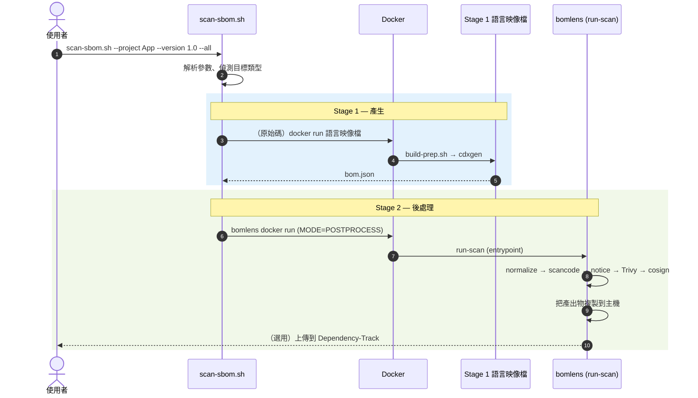
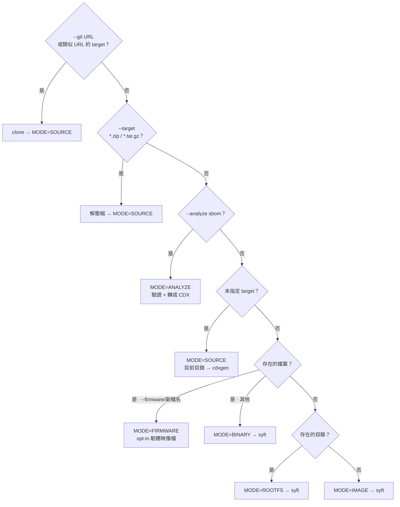
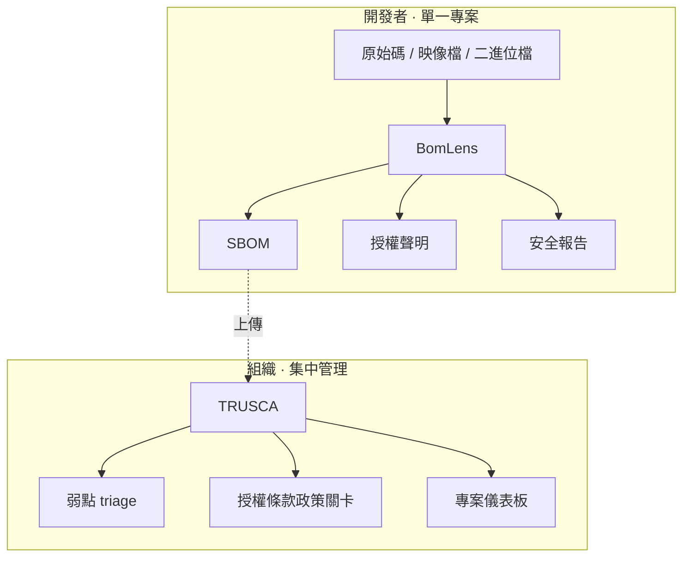

# 架構

這份文件說明 BomLens 的整體系統結構，以及掃描管線中每個工具在哪個步驟、以什麼順序被呼叫。

各輸入類型的工具流程——原始碼（含 ScanCode 與 SCANOSS 選項）、韌體、收到的 SBOM 與 AI 模型——請看[各輸入類型的流程](pipeline-by-input.md)。

> 這份文件以目前已實作的兩階段 (2-stage) 架構為準。原始碼的 Stage 1 分流（先偵測語言，再執行 cdxgen 官方語言映像檔）已在 `scripts/scan-sbom.sh` 實作並運作中。

## 一覽

BomLens 是一條由兩種 Docker 映像檔協力運作的兩階段管線。

- **Stage 1——產生**：原始碼由 cdxgen 各語言的官方映像檔產生 SBOM (CycloneDX 1.6)；容器映像檔、二進位檔與目錄則由 syft 產生。
- **Stage 2——後處理**：輕量的 `bomlens` 映像檔接手 SBOM，依序執行正規化、選用的精確授權條款偵測、產生授權聲明、安全報告、簽章與上傳。

編排的單一進入點是 `scripts/scan-sbom.sh`（Windows 為 `scan-sbom.bat`），使用者只需呼叫這一個指令碼。

---

## 為什麼分成兩階段

過去所有語言執行環境加上所有分析工具都塞在一個龐大的映像檔裡。重新設計後的管線把責任拆成兩半。

| | Stage 1 映像檔 | Stage 2 映像檔 (`bomlens`) |
|---|---|---|
| **角色** | 從原始碼**產生** SBOM | SBOM **後處理**（正規化、授權聲明、安全、簽章、上傳）以及 syft 掃描 |
| **內容** | cdxgen 官方**各語言**映像檔（java、python、node…） | **沒有**語言 toolchain——輕量的 `debian:12-slim` |
| **取得方式** | 偵測出專案語言後**按需下載** | 下載一次後重複使用 |
| **好處** | cdxgen 會維護各語言的最新 toolchain | 映像檔小；工具版本固定，確保可重現 |

> 五個主流語言（java、python、node、dotnet、php）用 cdxgen 官方映像檔的偵測結果完全相同；go、ruby 與 rust 則因為有 toolchain 的事前準備 (`build-prep.sh`) 而明顯更好。測量數據請看 [README「Why a Docker image?」](https://github.com/sktelecom/bomlens#why-a-docker-image-vs-plain-cdxgen)。

---

## 工具清單

管線會呼叫的工具，以及它們的**版本固定**狀況（供應鏈衛生）。

| 工具 | 版本 | 階段 | 角色 | 啟用條件 |
|------|------|------|------|-----------|
| **cdxgen** | 隨語言映像檔一併提供 | Stage 1 | 從原始碼產生 SBOM (`--spec-version 1.6`) | `MODE=SOURCE` |
| **build-prep.sh** | — | Stage 1 | cdxgen 執行前的相依項目準備（cargo、go、bundle、mvn、pip） | `MODE=SOURCE` |
| **syft** | `v1.51.0` | Stage 1 | 掃描映像檔、二進位檔與根檔案系統 | `MODE=IMAGE/BINARY/ROOTFS` |
| **jq** (`normalize-sbom.sh`) | — | Stage 2 | 正規化並排序 SBOM | 一律執行 |
| **ScanCode Toolkit** | `32.5.0` | Stage 2 | 對自有原始碼進行精確的授權條款偵測 | `--deep-license`（opt-in 建置） |
| **SCANOSS** | `1.54.2` | Stage 2 | 識別被複製納入 (vendored) 到沒有套件管理器的 C/C++ 原始碼裡的開放原始碼 | `--identify-vendored` |
| **jq** (`generate-notice.sh`) | — | Stage 2 | 產生開放原始碼授權聲明 (NOTICE) | `--notice` / `--all` |
| **Trivy** | `v0.74.0` | Stage 2 | 弱點 (CVE) 安全報告 | `--security` / `--all` |
| **Cosign** | `v2.6.5` | Stage 2 | SBOM 的 detached 簽章 | `--sign` |
| **curl** | — | Stage 2 | 上傳到 Dependency-Track | 預設（除非用 `--generate-only`） |

> 版本以 `docker/Dockerfile` 裡的 `ARG` 固定。為了讓映像檔保持精簡，ScanCode 是 **opt-in** 的建置參數 (`--build-arg SBOM_DEEP_LICENSE=true`)。SCANOSS 用戶端預設包含在內，若要移除請用 `--build-arg SBOM_SCANOSS=false` 建置。韌體的解包與識別（unblob、cve-bin-tool）放在另一個 opt-in 的 `bomlens-firmware` 映像檔，AI 模型的 SBOM 產生 (OWASP AIBOM Generator) 則放在 `bomlens-aibom`。各輸入類型的工具流程請看[各輸入類型的流程](pipeline-by-input.md)。

---

## 完整管線流程

用一張圖看工具被呼叫的**順序**。虛線方框是由旗標開啟的選用步驟。

從使用者呼叫到後處理的流程順序：

---

## Stage 1——產生 SBOM

產生工具依目標類型而異。

### 原始碼 (`MODE=SOURCE`)——cdxgen 語言映像檔

`scan-sbom.sh` 會用 `detect_lang()` 偵測專案語言，再用 `img_for_lang()` 挑出對應的 **cdxgen 官方語言映像檔**，下載後在該映像檔裡執行 `build-prep.sh`(`scripts/scan-sbom.sh:138-208`)。輕量的後處理映像檔沒有語言 toolchain，因此產生工作完全由語言映像檔負責。

各語言的 cdxgen 映像檔對應如下（`scan-sbom.sh:158-177`；標籤由 `CDXGEN_TAG` 固定）。

| 偵測到的語言 | 映像檔 |
|-----------|--------|
| rust | `cdxgen-debian-rust` |
| go | `cdxgen-debian-golang124` |
| ruby | `cdxgen-debian-ruby34` |
| java | `cdxgen-temurin-java21` |
| python | `cdxgen-python312` |
| node | `cdxgen-node20` |
| php | `cdxgen-debian-php84` |
| dotnet | `cdxgen-debian-dotnet9` |
| android | 自行建置的 `bomlens-android-sdk<API>`（compileSdk 會自動取出） |
| mixed / unknown | cdxgen all-in-one (`CDXGEN_ALLINONE`) |

映像檔內會執行兩個步驟：

1. **`build-prep.sh`** (`docker/lib/build-prep.sh`)——在 cdxgen **執行前**準備相依項目。它會為 cdxgen 無法自行解析的生態系（尤其是 Rust 與 Go）建立 lockfile，讓間接相依也能被看見。以 POSIX `sh` 撰寫，盡力而為（絕不會讓掃描失敗）。

   | 生態系 | 動作 | 備註 |
   |--------|------|------|
   | Rust | `cargo generate-lockfile` | cdxgen 不會自動執行 cargo——**必要** |
   | Go | `go mod download`(`-mod=mod`) | 解析出模組關係圖 |
   | Ruby | `bundle lock` / `install` | 只在沒有 lockfile 時執行 |
   | Maven | `mvn dependency:resolve` | 輕量的安全網 |
   | Python | `pip install -r requirements.txt` | 沒有 lockfile 時讓間接相依被看見 |

2. **執行 cdxgen**——`build-prep.sh` 會自動偵測各映像檔不同的 cdxgen 執行檔路徑，然後執行 `cdxgen -r --spec-version 1.6 -o bom.json`(`build-prep.sh:60-73`)。產生的 SBOM 接著交給 Stage 2 (`MODE=POSTPROCESS`) 的後處理映像檔。

### 映像檔／二進位檔／目錄——syft

`bomlens` 映像檔內含的 **syft** 會直接產生 SBOM。(`docker/entrypoint.sh`)

| MODE | 輸入 | syft 呼叫方式 |
|------|------|-----------|
| `IMAGE` | Docker 映像檔 | `syft <image> -o cyclonedx-json`（需要掛載 docker.sock） |
| `BINARY` | 單一檔案 | `syft file:<path> -o cyclonedx-json`（失敗時退回最小 SBOM） |
| `ROOTFS` | 目錄 | `syft dir:<path> -o cyclonedx-json` |

---

## Stage 2——後處理管線

`bomlens` 映像檔的進入點 `run-scan`(`docker/entrypoint.sh`) 接手 SBOM，並以**固定的順序**執行各步驟。每個步驟由一個環境變數開啟（等同於一個 CLI 旗標），輸出會累積到 `ARTIFACTS` 清單裡。

各步驟細節：

| # | 步驟 | 指令碼／工具 | 條件 | 輸出 |
|---|------|-----------------|------|--------|
| ① | **正規化** | `normalize-sbom.sh` (jq) | 一律執行（加上 `--byte-stable` 為決定性模式） | 更新 `bom.json` |
| ② | **精確授權條款** | `scancode` | `--deep-license` 且 `/src` 存在 | `_scancode.json` |
| ③ | **授權聲明** | `generate-notice.sh` (jq) | `--notice` / `--all` | `_NOTICE.txt`、`_NOTICE.html` |
| ④ | **安全報告** | `scan-security.sh` (Trivy) | `--security` / `--all` | `_security.{json,md,html}` |
| ⑤ | **簽章** | `cosign sign-blob` | `--sign` 且有 `COSIGN_KEY` | `bom.json.sig` |
| ⑥ | **風險報告** | `generate-risk-report.sh` | 預設（用 `--no-report` 略過） | `_risk-report.{md,html}`（ANALYZE 模式另有 `_conformance.*`） |
| ⑦ | **複製到主機** | `cp` | 一律執行 | 複製到 `HOST_OUTPUT_DIR` |
| ⑧ | **上傳** | `curl` | 預設（用 `--generate-only` 略過） | 上傳到 Dependency-Track 伺服器或 TRUSCA 的原生 ingest（用 `UPLOAD_TARGET` 選擇） |

> **為什麼順序是固定的**：正規化會把後續每個步驟的輸入穩定下來，所以最先執行；簽章必須針對最終的 `bom.json`，所以最後執行。每個步驟都是盡力而為——失敗時以 `|| true` 或警告處理，不會中止整次掃描（簽章與上傳例外）。

---

## 依輸入類型分流

`scan-sbom.sh` 會依 `--git`／`--analyze`／`--firmware` 以及 `--target` 的值自動決定模式。

判定由上往下進行，第一個符合的分支勝出。

> 與上面的分流無關，`--ui` 會啟動 `MODE=UI`（網頁伺服器 `server.py`），後續的掃描則透過表單或檔案上傳執行。

| 模式 | 觸發條件 | 產生工具 | 備註 |
|------|--------|-----------|------|
| `SOURCE` | 未指定目標、`--git <url>`，或 `--target *.zip/*.tar.gz` | cdxgen | 語言偵測決定要用哪個語言映像檔。git 目標會被 clone；壓縮檔會解開後當作原始碼處理。（網頁介面的 SOURCE 是在容器內使用 `syft dir:`） |
| `ANALYZE` | `--analyze <sbom>`（別名 `--sbom`） | — | 驗證供應者 SBOM (CycloneDX/SPDX)、轉成 CDX 並重新彙整。會產生 `_conformance.*` |
| `FIRMWARE` | `--target <file> --firmware`，或韌體副檔名 | unblob + syft + cve-bin-tool | **opt-in 映像檔** `bomlens-firmware`。細節請看[韌體分析指南](../guides/firmware.md) |
| `BINARY` | `--target <file>` | syft | `file:` scheme |
| `ROOTFS` | `--target <directory>` | syft | `dir:` scheme |
| `IMAGE` | `--target <image name>` | syft | 掛載 docker.sock |
| `AIBOM` | `--model <owner/name>` | OWASP AIBOM Generator | **opt-in 映像檔** `bomlens-aibom`。由 HuggingFace 模型卡產生 CycloneDX 1.7 ML-BOM，並加上 G7 符合性檢查 |
| `MODELFILE` | `--model-file <path>` | `identify-model-file.py`（標準函式庫） | 基礎映像檔，離線運作。從模型檔案自身的標頭讀出 CycloneDX 1.7 ML-BOM（GGUF、safetensors、PyTorch、pickle、npz、npy、ONNX）；加上同樣的 G7 檢查 |
| `UI` | `--ui` | — | 瀏覽器介面；所有掃描目標類型都透過表單或檔案上傳執行 |

---

## 旗標與步驟的對應 {#flag-to-step-mapping}

CLI 旗標會轉換成哪些環境變數、又會開啟哪些步驟（由 `scan-sbom.sh` 轉換後傳給 `entrypoint.sh`）。

| 旗標 | 環境變數 | 開啟的步驟 |
|--------|----------|-------------|
| （預設） | `GENERATE_REPORT=true`（並含授權聲明與安全） | 正規化 + **風險報告** + 上傳 |
| `--no-report` | `GENERATE_REPORT=false` | 不會強制開啟風險報告、授權聲明或安全步驟 |
| `--notice` | `GENERATE_NOTICE=true` | ③ 授權聲明 |
| `--security` | `GENERATE_SECURITY=true` | ④ 安全報告 |
| `--all` | 以上兩者 | ③ + ④ |
| `--git <url>` / `--branch` | （在主機上 clone） | 收集 SOURCE 輸入 |
| `--analyze <sbom>` | `MODE=ANALYZE` | 供應者 SBOM 的驗證、轉換與報告 |
| `--firmware` | `MODE=FIRMWARE`（韌體映像檔） | 先解包，再執行 syft + cve-bin-tool |
| `--model <owner/name>` | `MODE=AIBOM`（aibom 映像檔） | 從 HuggingFace 模型產生 ML-BOM，並加上 G7 檢查 |
| `--model-file <path>` | `MODE=MODELFILE` | 離線讀取單一模型檔案的標頭產生 ML-BOM，並加上 G7 檢查 |
| `--deep-license` | `DEEP_LICENSE=true` | ② scancode |
| `--byte-stable` | `BYTE_STABLE=true` | ① 決定性的正規化（也就是網頁介面的「可重現的輸出」開關） |
| `--sign` | `SIGN_SBOM=true`（並含 `COSIGN_KEY`/`COSIGN_PASSWORD`） | ⑤ 簽章 |
| `--generate-only` | `UPLOAD_ENABLED=false` | ⑦ 略過上傳 |
| `--ui` | `MODE=UI` | 網頁介面 |

> **風險報告** (`_risk-report.{md,html}`) 在所有模式下都會**預設產生**（它會彙整授權條款與弱點）。為了支援它，授權聲明與安全掃描會自動一併開啟；要停用請用 `--no-report`。

各項功能的使用方式請看[授權聲明與安全報告指南](../guides/reports.md)。

---

## 產出物

`{P}` 是專案名稱，`{V}` 是版本（特殊字元會正規化為 `_`）。

| 檔案 | 產生條件 |
|------|-----------|
| `{Project}_{Version}_bom.json` | 一律產生（CycloneDX 1.6；AI 模型為 1.7 ML-BOM） |
| `{Project}_{Version}_NOTICE.txt` / `.html` / `.pdf` | `--notice` / `--all` / 預設產生風險報告時（PDF 只在 `SBOM_PDF` 建置中提供） |
| `{Project}_{Version}_security.json` / `.md` / `.html` | `--security` / `--all` / 預設產生風險報告時 |
| `{Project}_{Version}_risk-report.md` / `.html` | 預設（所有模式）——用 `--no-report` 略過 |
| `{Project}_{Version}_conformance.json` / `.md` / `.html` | `--analyze`（供應者 SBOM 驗證） |
| `{Project}_{Version}_scancode.json` | `--deep-license` |
| `{Project}_{Version}_bom.json.sig` | `--sign` |

---

## 擴充點

### 新增一種語言的支援
1. 確認該語言是否有 cdxgen 官方映像檔——有的話就加進分流表。
2. 如果 cdxgen 無法自動解析間接相依，就在 `docker/lib/build-prep.sh` 加入準備邏輯。
3. 在 `examples/{language}/` 底下加一個範例專案，並在 `tests/cases/test-{language}.sh` 加一個測試案例。

完整流程請看[套件管理器指南](../contribute/package-managers.md)。

### 新增一個後處理步驟
在 `docker/lib/` 底下加一個輔助指令碼，從 `entrypoint.sh` 的共用管線區段（正規化之後）以環境變數守門的方式呼叫它，並把它的輸出附加到 `ARTIFACTS`。請把它放在簽章步驟**之前**，這樣它的輸出才會被簽章涵蓋。

---

## 設計原則

- **隔離**——所有分析都在 Docker 容器裡執行，主機環境不受影響。
- **關注點分離**——把產生 (Stage 1) 與後處理 (Stage 2) 拆開，讓後處理映像檔保持精簡。
- **可重現**——工具版本以 `ARG` 固定；`--byte-stable` 會產生位元組完全相同的輸出。
- **符合標準**——遵循 CycloneDX 1.6 規格。
- **強韌**——後處理步驟都是盡力而為，不會中止整次掃描。
- **單一介面**——所有語言與模式都透過同一個 `scan-sbom.sh` 呼叫。

---

## 角色分工 (TRUSCA)

BomLens 專精於**產生**。**治理**——全公司的專案管理、弱點分類與授權條款政策關卡——則交給姊妹專案 [TRUSCA](https://github.com/trustedoss/trusca)（前身為 TrustedOSS Portal）。兩個工具共用 cdxgen 與 Trivy，因此產出物 (CycloneDX) 可以直接互通。

---

> **相關文件**：[各輸入類型的流程](pipeline-by-input.md) | [快速開始](../start/first-scan.md) | [CLI 參考](../reference/cli.md) | [直接使用 Docker 映像檔](../reference/docker-image.md)
