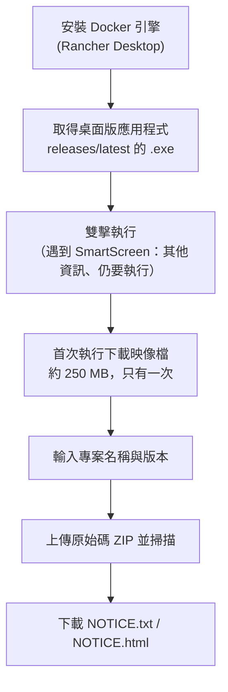

# 免指令列快速開始（不需要 CLI）

你不需要有打過任何指令的經驗。這一頁只講一件事：開放原始碼授權條款負責人拿到開發團隊給的原始碼後，要做出開放原始碼授權聲明的最短路徑。全程都在瀏覽器裡點選完成。

## 什麼是開放原始碼授權聲明

一份文件，整理產品內所含的開放原始碼元件與它們的授權條款，隨產品出貨時一併提供。許多開放原始碼授權條款（MIT、Apache-2.0、BSD 等）都要求把著作權標示與授權條款全文隨產品附上，因此需要一份把這些內容集中起來的授權聲明。

這個工具會分析原始碼，建立元件清單 ([SBOM](../concepts/what-is-sbom.md))，再依授權條款把元件分組，產生兩種授權聲明檔案。

- `..._NOTICE.txt` —— 可直接隨散布物出貨的文字格式
- `..._NOTICE.html` —— 適合用瀏覽器閱讀的格式

檔名前面那一段 (`...`) 是你輸入的專案名稱與版本。舉例來說，專案是 `MyApp`、版本是 `1.0.0`，檔案就會是 `MyApp_1.0.0_NOTICE.txt`。

## 需要準備什麼、要花多久

你需要的只有一套 Docker 引擎。在 Windows 上第一次安裝的話，建議用 **Rancher Desktop**——它免費，也很適合雙擊操作的流程。已經在用 Docker 的話，維持原樣繼續往下看就好。（其他選項的詳細比較放在[快速開始](../start/first-scan.md)。）

第一次的安裝與下載會花一點時間。大致如下：

- 安裝 Rancher Desktop 並第一次啟動：約 5–10 分鐘
- 第一次下載掃描器映像檔（約 250 MB）：通常一兩分鐘（依網路狀況而異，只有第一次需要）
- 第一次掃描專案時取得語言映像檔 (0.6–1.7 GB)：再多花幾分鐘，這也是每種語言只需一次

準備好之後，之後每次開啟應用程式並完成掃描只要 1–2 分鐘。

## 跟著做

有兩條路。桌面版應用程式最簡單，因此建議走這一條。整體流程如下：



### 方法 A——桌面版應用程式（建議）

1. **安裝 Docker 引擎**。到 [rancherdesktop.io](https://rancherdesktop.io/) 下載 Windows 版安裝程式，安裝後執行它。安裝過程若問你要不要使用 Kubernetes，關掉也可以。工作列圖示穩定下來（通常 1–2 分鐘）就代表準備好了。
2. **取得並執行應用程式**。點選 [下載 Windows 版 BomLens (.exe)](https://github.com/sktelecom/bomlens/releases/latest/download/BomLens-Setup.exe)，再雙擊下載到的檔案。目前還沒有簽章，所以 Windows 若跳出「Windows 已保護您的電腦」警告，請點「其他資訊」，再選「仍要執行」。應用程式會直接開啟，不會出現主控台視窗。
3. **首次執行下載映像檔**。掃描器映像檔只會下載一次。應用程式會像下面這樣顯示進度，請不要關掉視窗，耐心等待。之後啟動時，只要有更新的映像檔發佈，應用程式就會自動下載，因此不需要手動重新下載或重新安裝。


若 Docker 沒有安裝或已停止，應用程式不會開始掃描，而是告訴你該做什麼。


接下來請看下面的[掃描並取得授權聲明](#scan-and-get-the-notice)。

### 方法 B——ZIP 與雙擊批次檔（替代方案） {#path-b--zip-and-double-click-batch-file-alternative}

比起桌面版應用程式更想用指令碼的話，這條路也行得通。

1. **安裝 Docker 引擎**。與方法 A 的第 1 步相同。
2. **下載工具**。在[最新發行頁面](https://github.com/sktelecom/bomlens/releases/latest)的 assets 裡下載 `bomlens-cli-windows.zip` 並解壓縮。解壓後的資料夾裡應該看得到一個 `scripts` 資料夾。（儲存庫頁面上綠色的 Code 按鈕也可以下載 ZIP，但那是目前原始碼未發行的快照，不是打上標籤的正式發行版。）
3. **執行網頁介面**。雙擊 `scripts` 資料夾裡的 `sbom-ui.bat`。一開始會有黑色視窗顯示「正在下載掃描器映像檔（約 250 MB）」，下載完成後瀏覽器就會開啟 `http://localhost:8080`。每次掃描的結果會存到 `C:\Users\<你的使用者名稱>\sbom-output` 底下的 `{Project}_{Version}\` 子資料夾。

要確認一切就緒，請雙擊解壓後資料夾裡的 `scripts\check-setup.bat`。它會依你的 Windows 顯示語言，檢查 Docker 的安裝與執行狀態、掃描器映像檔以及連接埠狀態。


## macOS 顯示應用程式已損毀時 {#if-macos-says-the-app-is-damaged}

在 macOS 上，你可能會看到「『BomLens』已損毀，無法打開」的警告，而且只給你「移到垃圾桶」這個選項。應用程式其實沒有損毀。目前的 macOS 版本還沒有用 Apple Developer ID 完成程式碼簽章與公證 (notarization)，所以 macOS 會把下載來的應用程式隔離 (quarantine)，Gatekeeper 就把它擋下來。這和 Windows 上的 SmartScreen 警告是同一類的封鎖。

這個訊息的行為和常見的「未識別的開發者」警告不一樣。在較新的 macOS 上，對應用程式按右鍵選「打開」，或按「系統設定」裡的「強制打開」按鈕，通常都解不開。可靠的做法是從終端機移除隔離屬性。

1. 開啟 `.dmg`，把 `BomLens.app` 拖進「應用程式」資料夾。
2. 開啟「終端機」執行下面的指令，然後照平常的方式從「應用程式」開啟 BomLens。

   ```bash
   xattr -dr com.apple.quarantine /Applications/BomLens.app
   ```

在 Apple Silicon 的 Mac 上若還是打不開，執行一次下面的指令再試一次：

```bash
codesign --force --deep -s - /Applications/BomLens.app
```

這個步驟只是因為目前的 macOS 版本還沒完成簽章與公證才需要，等應用程式簽章之後就不會再遇到。

## 掃描並取得授權聲明 {#scan-and-get-the-notice}

從這裡開始，桌面版應用程式與網頁介面的操作相同。

1. 輸入專案名稱與版本。
2. 在「掃描目標」選「ZIP 上傳」，上傳開發團隊給你的原始碼 ZIP 檔。
3. 按下「執行掃描」。執行記錄會即時顯示，結束後就會出現結果概要。

> 如果要掃描的是磁碟上已經有的資料夾而不是 ZIP，桌面版應用程式有**新增資料夾…**按鈕。走 `sbom-ui.bat` 這條路的話，執行前把 `SBOM_UI_MOUNT_DIR` 設成那個資料夾，網頁介面就能存取它（對應的 CLI 寫法是 `--ui --mount <dir>`）。


掃描結束後，就能在結果畫面依格式（`HTML`、`TXT`）分別下載授權聲明。一起產生的 SBOM (`..._bom.json`) 與開放原始碼風險報告 (`..._risk-report.html`) 也在同一個畫面上，你也可以用「全部下載 (ZIP)」一次取得全部檔案。下載的檔案同時也會存到結果資料夾。


## 卡住的時候

- **不知道問題出在哪**：雙擊 `scripts\check-setup.bat`，它會一次檢查 Docker、映像檔與連接埠狀態，並告訴你下一步該做什麼。它會跟著你的 Windows 顯示語言：韓文系統顯示韓文，其他一律英文。想固定用哪一種，就在下面說明的設定檔裡寫上 `SBOM_LANG=en`（或 `ko`）。
- **跳出「Windows 已保護您的電腦」警告**：這是因為桌面版應用程式目前還沒有簽章。點「其他資訊」再選「仍要執行」就好。
- **macOS 說應用程式「已損毀」**：這不是真的損毀，而是同一種未簽章封鎖。請看 [macOS 顯示應用程式已損毀時](#if-macos-says-the-app-is-damaged)，那裡有從終端機解開的方法。
- **顯示「Docker 未安裝」**：請確認 Rancher Desktop 已經安裝並且正在執行。
- **顯示「Docker 引擎未在執行」**：請啟動 Rancher Desktop，等圖示穩定下來後再執行一次。
- **掃描完成了，結果資料夾裡卻沒有檔案**：結果資料夾位在 Docker 的檔案共享範圍之外時，就可能這樣。這個工具會存到你家目錄 (`C:\Users\...`) 底下的 `sbom-output`，通常是安全的。若還是看不到檔案，請直接用瀏覽器畫面上的下載按鈕取得。
- **瀏覽器沒有自動開啟**：請自己在網址欄輸入 `http://localhost:8080`。若 8080 連接埠已被占用，啟動程式會改用下一個空閒的連接埠，並印出它選用的位址，請改用那個位址。
- **在公司網路上出現「映像檔下載失敗」**：這幾乎都是代理伺服器造成的。映像檔是由 **Docker daemon** 下載，不是啟動程式，所以在命令提示字元裡設定的代理伺服器沒有作用——請在 Docker Desktop (`Settings > Resources > Proxies`) 或 Rancher Desktop (`Preferences > WSL > Proxy`) 裡設定。如果代理伺服器連 `localhost` 都一併攔截，請把 `localhost` 加進它的略過清單，否則即使掃描正常執行，瀏覽器還是會顯示錯誤。
- **完全沒有可用的網路**：啟動程式可以改用檔案安裝，不必下載。請索取 `bomlens-image.tar`，放到那些 `.bat` 檔旁邊，它就會被自動採用——不需要網路，也不需要指令列。請參考下面的「設定檔」。

## 設定檔（不需要指令列）

你在命令提示字元裡設定的環境變數，在雙擊 `.bat` 時並不會生效，因此啟動程式也會讀取一個純文字檔。把 `scripts\bomlens.settings.example.txt` 複製成同一個資料夾裡的 `bomlens.settings.txt`，再把需要的那幾行取消註解：

```
SBOM_LANG=en
UI_PORT=9090
SBOM_PULL=never
SBOM_IMAGE_TAR=D:\bomlens-image.tar
```

這個檔案的註解同時附有英文與韓文。若你確實設了環境變數，環境變數還是優先於這個檔案。

更詳細的說明與指令列用法，請看[快速開始](../start/first-scan.md)與[授權聲明與安全報告指南](../guides/reports.md)。

---

> **相關文件**：[快速開始](../start/first-scan.md) | [授權聲明與安全報告指南](../guides/reports.md)
